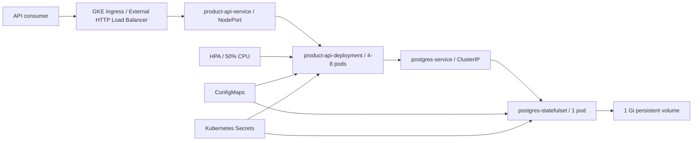

# NAGP Kubernetes, DevOps & FinOps Assignment

A GitHub-ready Product Catalog system for the **NAGP 2026 Technology Band III Batch - Workshop on Kubernetes, DevOps & FinOps**.

The project contains a Node.js/Express API, PostgreSQL database, Docker build, and plain Kubernetes manifests for a GKE Standard cluster. The API is replicated and externally exposed through GKE Ingress; PostgreSQL is internal-only and persists its data on a PVC.

## Submission Links

- Repository: `https://github.com/baludeepak7/nagp-k8s-devops-finops-assignment`
- Docker Hub: `https://hub.docker.com/r/deepakbalu/nagp-product-api`
- Product API: `http://34.98.89.237/products`
- Health API: `http://34.98.89.237/health`
- Screen recording: ``


## Architecture



Traffic follows `Ingress -> NodePort Service -> API pods -> ClusterIP Service -> PostgreSQL`. The application uses the stable Kubernetes DNS name `postgres-service`, never a Pod IP.

## Tech Stack

- Node.js 20, Express, and `pg` connection pooling
- PostgreSQL 16
- Docker with `node:20-alpine`
- Kubernetes Deployment, StatefulSet, Services, Ingress, HPA, ConfigMaps, Secrets, ResourceQuota, and LimitRange
- Google Kubernetes Engine Standard
- Docker Hub image registry

## Project Structure

```text
nagp-k8s-devops-finops-assignment/
|-- src/
|   `-- index.js
|-- docs/
|   `-- ASSIGNMENT_DOCUMENTATION.md
|-- k8s/
|   |-- namespace.yaml
|   |-- api-configmap.yaml
|   |-- api-deployment.yaml
|   |-- api-service.yaml
|   |-- api-ingress.yaml
|   |-- api-hpa.yaml
|   |-- postgres-configmap.yaml
|   |-- postgres-init-configmap.yaml
|   |-- postgres-statefulset.yaml
|   |-- postgres-service.yaml
|   |-- resource-quota.yaml
|   `-- limit-range.yaml
|-- .dockerignore
|-- .gitignore
|-- Dockerfile
|-- package.json
|-- package-lock.json
`-- README.md
```

## API Endpoints

### `GET /health`

```json
{
  "status": "UP",
  "service": "nagp-product-api"
}
```

### `GET /products`

Returns the eight products created by `k8s/postgres-init-configmap.yaml`. PostgreSQL `NUMERIC` values are returned by `pg` as strings to preserve decimal precision.

## Prerequisites

- Google Cloud account with billing enabled
- A GCP project with permission to create GKE and networking resources
- `gcloud` CLI installed and authenticated
- `kubectl` installed
- Docker installed and running
- Docker Hub account

## Run Locally

Start a local PostgreSQL instance:

```bash
docker run --name nagp-postgres --rm -d \
  -e POSTGRES_DB=nagpdb \
  -e POSTGRES_USER=nagpuser \
  -e POSTGRES_PASSWORD=<LOCAL_DB_PASSWORD> \
  -p 5432:5432 \
  postgres:16-alpine
```

Initialize it with the SQL from `k8s/postgres-init-configmap.yaml`, then install and run the API:

```bash
npm ci
export DB_HOST=localhost
export DB_PORT=5432
export DB_NAME=nagpdb
export DB_USER=nagpuser
export DB_PASSWORD=<LOCAL_DB_PASSWORD>
export PORT=3000
npm start
```

For PowerShell, set values with `$env:DB_HOST = "localhost"` and the equivalent command for each variable. Test with `curl http://localhost:3000/health` and `curl http://localhost:3000/products`.

## Build and Push the Image

Update the image field in `k8s/api-deployment.yaml`, then run:

```bash
docker login
docker build -t deepakbalu/nagp-product-api:v1 .
docker push deepakbalu/nagp-product-api:v1
```

Optional local container test:

```bash
docker run --rm -p 3000:3000 \
  -e DB_HOST=host.docker.internal \
  -e DB_PORT=5432 \
  -e DB_NAME=nagpdb \
  -e DB_USER=nagpuser \
  -e DB_PASSWORD=<LOCAL_DB_PASSWORD> \
  -e PORT=3000 \
  YOUR_DOCKERHUB_USERNAME/nagp-product-api:v1
```

## Create the GKE Standard Cluster

```bash
gcloud config set project YOUR_GCP_PROJECT_ID
gcloud config set compute/zone asia-south1-a

gcloud services enable container.googleapis.com compute.googleapis.com

gcloud container clusters create nagp-cluster \
  --zone asia-south1-a \
  --num-nodes 2 \
  --machine-type e2-medium \
  --disk-size 20 \
  --enable-ip-alias \
  --release-channel regular

gcloud container node-pools create assignment-pool \
  --cluster nagp-cluster \
  --zone asia-south1-a \
  --machine-type e2-medium \
  --num-nodes 2

gcloud container clusters get-credentials nagp-cluster --zone asia-south1-a

kubectl get nodes
```

> **Capacity note:** four API pods plus PostgreSQL request only `500m` CPU and `640Mi` memory, but GKE system workloads also consume node resources. If any pods remain Pending, inspect `kubectl describe pod` and resize the node pool or add nodes. A production cluster should be regional and multi-node.

## Deploy to Kubernetes

Secret values are intentionally not stored in any Kubernetes YAML file. Create the namespace first, then create both Kubernetes Secret objects from a local environment variable before applying the rest of the manifests.

```bash
kubectl apply -f k8s/namespace.yaml

export NAGP_DB_PASSWORD='<CHOOSE_A_STRONG_PASSWORD>'

kubectl create secret generic product-api-secret \
  --namespace nagp \
  --from-literal=DB_PASSWORD="$NAGP_DB_PASSWORD" \
  --dry-run=client \
  -o yaml | kubectl apply -f -

kubectl create secret generic postgres-secret \
  --namespace nagp \
  --from-literal=POSTGRES_PASSWORD="$NAGP_DB_PASSWORD" \
  --dry-run=client \
  -o yaml | kubectl apply -f -

kubectl apply -f k8s/

kubectl rollout status statefulset/postgres-statefulset -n nagp
kubectl rollout status deployment/product-api-deployment -n nagp
```

Do not commit the generated Secret YAML output or real database passwords. In production, prefer Google Secret Manager with External Secrets or the Secrets Store CSI Driver.

The init SQL runs only when PostgreSQL initializes an empty data directory. Updating the ConfigMap later does not rerun it against an existing PVC.

## Verify Objects

```bash
kubectl get all -n nagp
kubectl get pods -n nagp -o wide
kubectl get pvc -n nagp
kubectl get ingress -n nagp
kubectl get hpa -n nagp
kubectl get configmap -n nagp
kubectl get secret -n nagp
kubectl describe resourcequota nagp-resource-quota -n nagp
kubectl describe limitrange nagp-limit-range -n nagp
```

Check application and database logs when troubleshooting:

```bash
kubectl logs deployment/product-api-deployment -n nagp
kubectl logs postgres-statefulset-0 -n nagp
```

## Get the Ingress IP and Test

GKE can take several minutes to provision the external HTTP load balancer and backend health checks.

```bash
kubectl get ingress product-api-ingress -n nagp -w
kubectl get ingress product-api-ingress -n nagp -o jsonpath="{.status.loadBalancer.ingress[0].ip}"

curl http://34.98.89.237/health
curl http://34.98.89.237/products
```

Expected result: `/health` reports `UP`, and `/products` returns eight rows.

## Demonstrate Self-Healing

Delete one API pod. The Deployment creates a replacement and maintains the desired replica count:

```bash
kubectl get pods -n nagp
kubectl delete pod postgres-statefulset-0  -n nagp
kubectl get pods -n nagp -w
```

Delete the PostgreSQL pod. The StatefulSet recreates `postgres-statefulset-0` and reattaches its existing PVC:

```bash
kubectl get pods -n nagp
kubectl delete pod <POSTGRES_POD_NAME> -n nagp
kubectl get pods -n nagp -w
curl http://34.98.89.237/products
```

The same eight records prove that data survived Pod replacement. Deleting the PVC is different: it removes the persistent data after the storage policy completes deletion.

## Demonstrate a Rolling Update

For the demo, add `"version": "v2"` to the `/health` response, then build and push a second immutable tag:

```bash
docker build -t YOUR_DOCKERHUB_USERNAME/nagp-product-api:v2 .
docker push YOUR_DOCKERHUB_USERNAME/nagp-product-api:v2

kubectl set image deployment/product-api-deployment product-api=deepakbalu/nagp-product-api:v2 -n nagp
kubectl rollout status deployment/product-api-deployment -n nagp
kubectl rollout history deployment/product-api-deployment -n nagp
curl http://34.98.89.237/health
```

The strategy permits one extra pod and one unavailable pod during rollout. Roll back if needed:

```bash
kubectl rollout undo deployment/product-api-deployment -n nagp
```

## Demonstrate the HPA

GKE normally supplies resource metrics through its metrics pipeline. Verify metrics first; if `kubectl top` is unavailable, enable/install a compatible Metrics Server for the cluster version before continuing.

Terminal 1:

```bash
kubectl top nodes
kubectl top pods -n nagp
kubectl get hpa -n nagp
kubectl run -i --tty load-generator --rm --restart=Never --image=busybox:1.36 -n nagp -- /bin/sh
```

Inside the load-generator container:

```sh
while true; do wget -q -O- http://product-api-service/products > /dev/null; done
```

Terminal 2:

```bash
kubectl get hpa -n nagp -w
kubectl top pods -n nagp
```

The HPA compares observed CPU usage with the API request of `100m`; its target is 50%, or approximately `50m` average CPU per pod. Scale-up is not immediate because metrics collection and stabilization take time.

## FinOps and Resource Optimization

- **Requests and limits:** each API pod requests `100m` CPU and `128Mi` memory and is capped at `500m` and `512Mi`, supporting predictable scheduling and bounded usage.
- **Demand-based scaling:** HPA maintains 4-8 replicas and targets 50% average CPU utilization.
- **Observed metrics:** capture `kubectl top pods -n nagp` under idle, typical, and peak load. Adjust requests near a measured high percentile plus headroom; set memory limits above stable peak usage and validate with load tests. Avoid lowering requests from a single short sample.
- **ResourceQuota:** caps aggregate namespace CPU, memory, PVC count, and LoadBalancer Services.
- **LimitRange:** supplies defaults for future containers that omit resource boundaries.
- **Internal database networking:** PostgreSQL uses `ClusterIP`, avoiding a second external load balancer and public exposure.
- **Cluster Autoscaler:** use it with multiple nodes so node capacity follows pending workload demand.
- **Spot nodes:** place fault-tolerant API replicas on Spot VMs while keeping PostgreSQL on regular nodes.
- **Storage right-sizing:** monitor volume use and IOPS, then choose the appropriate GKE StorageClass and PVC size instead of overprovisioning.
- **Separate node pools:** isolate stateless, stateful, and Spot workloads with labels, taints, tolerations, and suitable machine families.

The assignment values contain a deliberate capacity tension: at eight API replicas their CPU limits total the entire `4 CPU` namespace quota. PostgreSQL also has a CPU limit, so the quota can reject the final HPA scale-up. The baseline is valid, but production tuning must either increase the quota from observed peak demand, reduce justified per-pod limits after testing, or set `maxReplicas` to the quota-feasible count. Confirm events with `kubectl describe hpa` and `kubectl get events -n nagp --sort-by=.lastTimestamp`.
