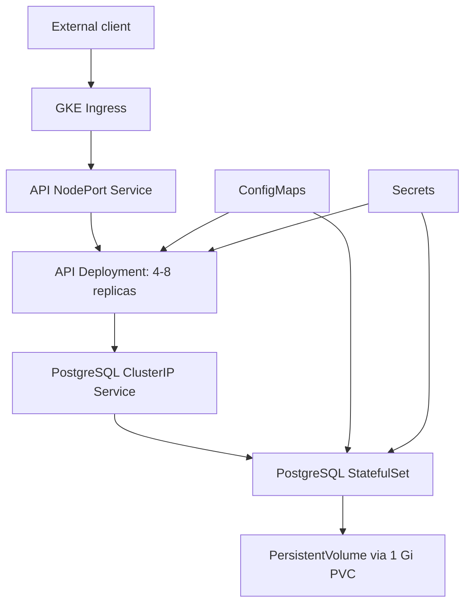

# Assignment Documentation

## 1. Requirement Understanding

The solution must demonstrate a containerized multi-tier application on GKE Standard. A public Node.js API reads a Product Catalog from a private PostgreSQL database. Kubernetes must provide configuration, secret injection, persistence, self-healing, rolling updates, autoscaling, and enforceable FinOps controls without Helm.

## 2. Assumptions

- The operator replaces Docker Hub, GitHub, GCP project, and Ingress IP placeholders.
- The Docker Hub repository is public, or an `imagePullSecret` is added for a private repository.
- GKE's metrics pipeline is available for HPA resource metrics.
- The default GKE StorageClass dynamically provisions the 1 Gi `ReadWriteOnce` PVC.
- The sample Secret is acceptable only for demonstration. Production secrets come from Secret Manager or another external secret system.
- Plain HTTP is sufficient for the assignment; production exposure uses DNS, a managed certificate, and HTTPS.

## 3. Solution Overview

`product-api-deployment` runs four Express replicas initially. `product-api-service` distributes internal traffic, and GKE Ingress provisions the external HTTP entry point. The API uses a `pg.Pool` and resolves PostgreSQL through `postgres-service`. PostgreSQL runs as a one-replica StatefulSet with a stable PVC and initializes the eight required products on the first empty-volume startup.

## 4. Architecture

The requirement mapping is:

| Requirement | Implementation |
|---|---|
| API externally exposed | GKE Ingress routes `/health` and `/products` |
| API pods | Deployment with 4 initial replicas |
| Database pod | StatefulSet with 1 replica |
| Database persistence | 1 Gi PVC from `volumeClaimTemplates` |
| Database internal only | `ClusterIP` Service |
| Non-secret DB configuration | ConfigMaps provide host, port, name, and user |
| Database password | Kubernetes Secrets are created at deploy time and inject it at runtime |
| No Pod IP communication | API uses `postgres-service` DNS |
| Rolling updates | Deployment `RollingUpdate`, surge 1, unavailable 1 |
| Self-healing | Deployment and StatefulSet reconcile deleted pods |
| Autoscaling | `autoscaling/v2` HPA with 50% CPU target |
| FinOps | requests/limits, HPA, quota, defaults, private DB, 1 Gi PVC, metrics workflow |

## 5. Kubernetes Resource Justification

- **Namespace:** isolates the assignment and provides one cleanup boundary.
- **Deployment:** fits a stateless API and supports replica management and rolling replacement.
- **NodePort Service:** supplies a stable backend compatible with the GCE Ingress controller.
- **Ingress:** creates one external HTTP entry point and path routing without exposing the API pods directly.
- **HPA:** changes API replica count from 4 to 8 based on CPU utilization.
- **StatefulSet:** gives PostgreSQL stable identity and storage association.
- **ClusterIP Service:** provides private database DNS and load-balancer-free connectivity.
- **ConfigMaps and Secrets:** separate deploy-time configuration from the image and source code.
- **ResourceQuota and LimitRange:** bound aggregate consumption and default future container resources.

## 6. Database Persistence Strategy

The StatefulSet creates `postgres-data-postgres-statefulset-0` from its volume claim template. Kubernetes reattaches that PVC when the database pod is deleted and recreated, so data outlives the pod. `init.sql` is mounted at `/docker-entrypoint-initdb.d/init.sql`; the official PostgreSQL image executes it only when the data directory is empty. The PVC is sized at 1 Gi for the small assignment dataset and should be resized from observed storage growth in a real service.

## 7. Configuration and Secret Management

The API ConfigMap supplies `DB_HOST=postgres-service`, `DB_PORT=5432`, `DB_NAME=nagpdb`, `DB_USER=nagpuser`, and `PORT=3000`. A Kubernetes Secret supplies only `DB_PASSWORD`. PostgreSQL receives matching database and user values from its own ConfigMap, and the password from a separate Kubernetes Secret.

The password value is not committed in any Kubernetes YAML file. During deployment, the operator creates `product-api-secret` and `postgres-secret` from a local environment variable by using `kubectl create secret ... --dry-run=client -o yaml | kubectl apply -f -`. This keeps the repository free of clear-text passwords while still using native Kubernetes Secret objects at runtime. Base64 encoding is not encryption, so generated Secret YAML output should not be committed. Production should use Google Secret Manager with an External Secrets or Secrets Store CSI Driver integration, IAM least privilege, encryption at rest, rotation, and restricted RBAC.

## 8. Self-Healing Explanation

The Deployment controller continuously compares four desired API replicas with live pods and creates a replacement after deletion or failure. The StatefulSet similarly recreates its ordinal database pod and associates it with the existing claim. Readiness probes prevent unready pods from receiving Service traffic; liveness probes restart processes that stop responding. A single database replica demonstrates recovery, but it does not provide database high availability during restart.

## 9. Rolling Update Strategy

`maxSurge: 1` permits one temporary API pod above the desired count, while `maxUnavailable: 1` permits at most one desired replica to be unavailable. Readiness gates traffic to replacements. Immutable image tags such as `v1` and `v2`, `kubectl rollout status`, history, and undo provide a clear release demonstration. Production should use digest-pinned images and automated health validation.

## 10. HPA Demonstration

The HPA watches `product-api-deployment`, maintains 4-8 pods, and targets average CPU utilization at 50% of the `100m` request. Generate repeated `/products` requests from an in-cluster BusyBox pod, watch `kubectl get hpa -n nagp -w`, and correlate it with `kubectl top pods -n nagp`. Scaling depends on metrics collection intervals and stabilization behavior, so it is not instantaneous.

## 11. FinOps Implementation

Each API container requests `100m` CPU and `128Mi` memory and is capped at `500m` CPU and `512Mi`. Requests let the scheduler reserve realistic baseline capacity; limits bound runaway use. HPA adds capacity only when CPU demand justifies it. ResourceQuota caps namespace totals, PVC count, and LoadBalancer Services. LimitRange prevents future containers from silently omitting boundaries. PostgreSQL remains a ClusterIP Service, avoiding unnecessary public load-balancer cost.

## 12. Cost Optimization Opportunities

1. Enable Cluster Autoscaler across an appropriately sized node pool so unused nodes can be removed and pending replicas can trigger capacity.
2. Run fault-tolerant API replicas on Spot VMs while keeping PostgreSQL on regular nodes with scheduling constraints.
3. Monitor storage consumption, IOPS, and throughput to select the correct StorageClass and PVC size.
4. Separate stateless, stateful, and Spot workloads into node pools using labels, taints, and tolerations.
5. Use GKE cost allocation labels, budgets, alerts, and billing export to attribute and detect changes.
6. Review external load balancers and static IPs regularly; retain only the single required public entry point.

## 13. Resource Optimization Using Observed Metrics

Collect `kubectl top pods -n nagp` and `kubectl top nodes` during idle, normal, and controlled peak tests. Retain a time series in production through Cloud Monitoring or Prometheus. Set CPU requests from a representative high percentile with headroom, because undersized CPU requests cause aggressive HPA behavior and poor scheduling. Set memory requests near sustained working-set demand and limits safely above peak, because exceeding a memory limit causes an OOM kill. Re-test latency and error rate after every change.

The exact assignment values conflict at the theoretical maximum: eight API replicas at a `500m` CPU limit consume all `4 CPU` of quota, leaving no CPU-limit allowance for PostgreSQL. The four-replica baseline fits. Under peak scaling, inspect namespace events; then either raise the quota based on approved budget, lower justified limits after measurement, or reduce the maximum replica count. Quota should be treated as an intentional financial guardrail, not a substitute for capacity planning.